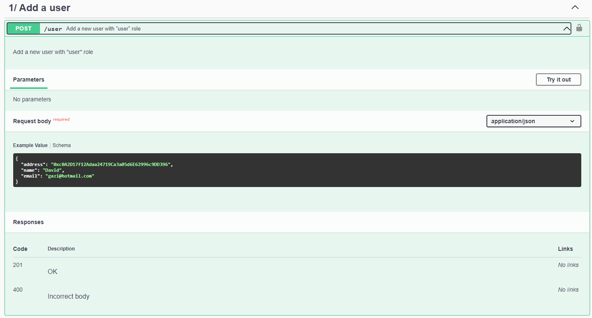

# Project presentation

This project is a NFT manager written in TypeScript. We're exposing our API routes with Express as it is a simple library.

The database, in SQLite, is created and managed via Sequelize. This way you don't need to use docker because data is stored in a local file.

The tests are written thanks to Mocha and Chai, because we already used it a lot.

# How to use the project

First of all, enter the command below

```shell
yarn install
```

This will install all the dependencies you need.

Then, launch:

```shell
yarn db-init
```

This will populate the database with some data (2 Admins, 2 NFTs, 1 Team)

After that, to launch the server, use:

```shell
yarn start
```

Wait a few seconds, and then go at http://localhost:3000/api to get the swagger documentation.

The swagger is splited in differents categories.

## 1/ Add a user



Click on the /user endpoint and click on "Try it out" button. Then click Execute. This will create a user. In the response body, copy the given password (you will need it after).

## 2/ Get bearer token

In the category "2/ Get bearer token", click on the only endpoint available. Click on try it out and paste the password you copied in the password field of the request body. Please also make sure the email is the correct email (the one which you created the user with).

In response body, you will get your access token. Copy it and click on the authorize button in the top-right corner of the swagger.


Then paste your token, click "Authorize" and then "Close". Now you will be able access all endpoints that need you to be logged in. If your token is from an user with admin role, then you can access all endpoints.

## Other categories

Please see the documentation at http://localhost:3000/api

# Authors

David Ghiassi

Remy Dao

Louis Arrignon

Niels Beeker
